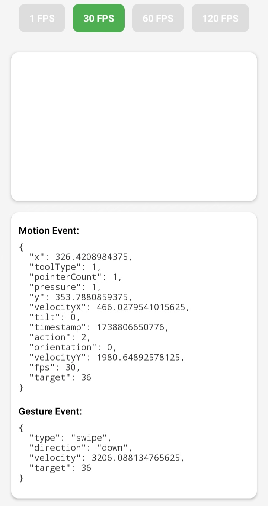

# motion-event [](https://choosealicense.com/licenses/mit/)

**Motion Event** is an Expo module that provides seamless access to Android's native `MotionEvent` API, allowing developers to capture and interact with low-level touch and motion events in their React Native applications.

## 🚧 Work In Progress

**⚠️ This package is still under development and is not yet ready for production use. It is not installable or usable at the moment. Please do not use it in production environments.**

The module is being actively worked on, and updates will be made to the README as the project becomes stable and usable.

## 🎨 Preview

<p align="center">
  
</p>

## ⚙️ Usage

```tsx
import { MotionEventView } from "motion-event";
import React, { useState } from "react";
import { Text, View } from "react-native";

export default function App() {
  const [motionEvent, setMotionEvent] = useState<MotionEventPayload | null>(null);
  const [gestureEvent, setGestureEvent] = useState<GestureEventPayload | null>(null);
  const [targetFPS, setTargetFPS] = useState(30);

  const handleMotionEvent = (event: { nativeEvent: MotionEventPayload }) => {
    setMotionEvent(event.nativeEvent);
  };

  const handleGestureEvent = (event: { nativeEvent: GestureEventPayload }) => {
    setGestureEvent(event.nativeEvent);
  };

  return (
    <View>
      <MotionEventView
        targetFPS={targetFPS}
        onMotionEvent={handleMotionEvent}
        onGestureEvent={handleGestureEvent}
      />

      <Text>Motion Event:</Text>
      <Text>
        {motionEvent
          ? JSON.stringify(motionEvent, null, 2)
          : "No motion events yet"}
      </Text>

      <Text>Gesture Event:</Text>
      <Text>
        {gestureEvent
          ? JSON.stringify(gestureEvent, null, 2)
          : "No gesture events yet"}
      </Text>
    </View>
  );
}
```

## 🚀 Features

- Access to Android's native `MotionEvent` API for handling motion and touch events.
- Capture all types of motion events in a simple and efficient way.
- Easy to use in Expo projects.
- Written in TypeScript for better developer experience and type safety.

