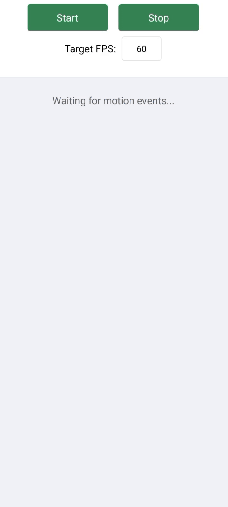

# motion-event [](LICENSE)

A lightweight Expo module for observing raw Android touch events at the app window.

## Motivation

Gesture libraries such as [React Native Gesture Handler](https://github.com/software-mansion/react-native-gesture-handler) and [React Native Reanimated](https://github.com/software-mansion/react-native-reanimated) provide higher-level gesture and animation APIs. `motion-event` is intended for cases that need lower-level touch data, including custom multi-touch interactions and real-time input tracking.

- Access to Android `MotionEvent` data
- Multi-touch coordinates and pointer properties
- Primary-pointer velocity
- Configurable `MOVE` event rate from 1 to 120 updates per second
- Immediate delivery of gesture lifecycle events such as `DOWN`, `UP`, `CANCEL`, `POINTER_DOWN`, and `POINTER_UP`
- Support for Expo development builds and bare React Native apps

## Usage

```bash
pnpm add motion-event
```

The package contains native Android code. It requires an Expo development build or a bare React Native app, does not run in Expo Go, and does not support iOS or web.

```tsx
import { useEffect, useState } from "react";
import { Pressable, Text, TextInput, View } from "react-native";
import { SafeAreaProvider, SafeAreaView } from "react-native-safe-area-context";
import {
  addMotionEventListener,
  type MotionEvent,
  startListening,
  stopListening,
} from "motion-event";

export default function App() {
  const [event, setEvent] = useState<MotionEvent | null>(null);
  const [fps, setFps] = useState("60");

  useEffect(() => {
    startListening({ targetFps: Number(fps) });
    const subscription = addMotionEventListener(setEvent);

    return () => {
      subscription.remove();
      stopListening();
    };
  }, [fps]);

  return (
    <SafeAreaProvider>
      <SafeAreaView>
        <View>
          <Pressable onPress={() => startListening({ targetFps: Number(fps) })}>
            <Text>Start</Text>
          </Pressable>
          <Pressable onPress={stopListening}>
            <Text>Stop</Text>
          </Pressable>
          <TextInput value={fps} onChangeText={setFps} keyboardType="numeric" />
        </View>
        <Text>{JSON.stringify(event, null, 2)}</Text>
      </SafeAreaView>
    </SafeAreaProvider>
  );
}
```

The repository includes a complete example app in `example`. Run it with `pnpm android:example`.

## Preview

<p align="center">
  
</p>

## API

### `startListening(options?)`

Starts observing touch events. `targetFps` controls the maximum delivery rate for `MOVE` events and defaults to 60. The value is rounded and clamped to the range 1–120. A non-finite value throws a `RangeError`.

Calling `startListening` while the module is already active updates the rate without installing another native listener.

```typescript
interface StartListeningOptions {
  targetFps?: number;
}

function startListening(options?: StartListeningOptions): void;
```

### `stopListening()`

Stops observing touch events. Calling it while the module is already stopped is safe.

```typescript
function stopListening(): void;
```

### `addMotionEventListener(listener)`

Registers a JavaScript listener and returns a subscription. Remove the subscription when it is no longer needed.

```typescript
function addMotionEventListener(
  listener: (event: MotionEvent) => void,
): EventSubscription;
```

### Event data

Each event contains the Android action values, timing and device metadata, coordinates and properties for every active pointer, raw primary-pointer coordinates, precision, primary-pointer velocity in pixels per second, and the configured `MOVE` event rate in `targetFps`.

`MotionEventActions` and `ToolTypes` export the corresponding Android integer constants used by the event fields.

## Contributing

See [CONTRIBUTING.md](CONTRIBUTING.md).
